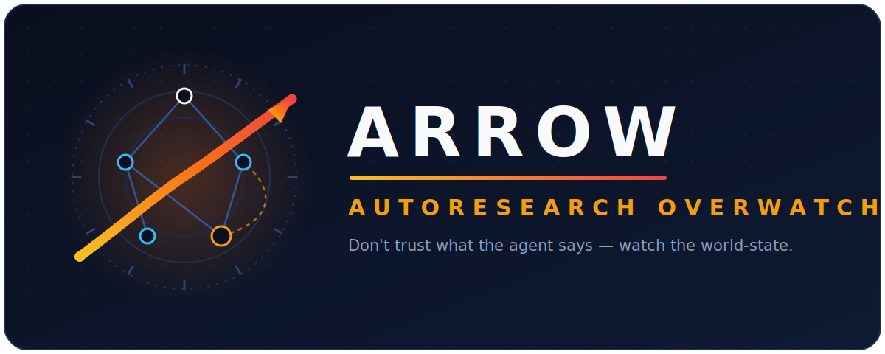

<p align="center">
  
</p>

# Arrow — AutoResearch Overwatch

**Arrow (AutoResearch Overwatch)** is a graph-native overwatch layer for
multi-agent auto-research. A research question becomes a task graph; a team of
agents works the graph; Arrow is the **PI (principal investigator)** that watches
over them — and, using **purely programmatic signals** (file hashes, metric
trajectories, exit codes, manifest tuples), catches the agent that hangs,
plateaus, falsely claims completion, breaks comparability, or contaminates
downstream results — then auto-remediates.

> **Thesis: don't evaluate what an agent _says_ — only whether the _world-state_
> changed.** No LLM judge anywhere in the supervision path.

The mock path is fully deterministic and offline: zero LLM/API/network calls,
every scenario finishes in seconds. The live path (M10) runs the **same**
overwatch code over real agents, real data, and real training.

```bash
pip install networkx pyyaml pytest        # rich optional
pytest -q                                 # unit suite (L0)

python run.py --mock --scenario green      # clean run      -> RESEARCH ANSWERED
python run.py --mock --scenario plateau    # plateau kill   -> NEGATIVE RESULT + graph surgery
python run.py --mock --scenario trap_b     # comparability  -> COMPARABILITY_BLOCK, blame N4
python run.py --mock --scenario hung       # stall          -> HUNG_RESTART then kill

python run.py --serve                      # dashboard at http://127.0.0.1:8000/
python run.py --replay runs/<ts>/replay.jsonl   # re-render a run, no workers executed
```

Each run writes `runs/<ts>/`: `state.json` (per-tick snapshot), `replay.jsonl`,
`incidents.jsonl` (the black box), per-node working dirs, and `report/report.md`
(the anytime report).

---

## Why an overwatch layer?

Your agent team is running a 3-hour experiment. One agent silently spins,
burning tokens. Another quietly edits the eval script so its numbers look
better. A third reports *"done, beat baseline by 5 points"* — it tested on the
training set. Today, every agent framework gives you the same thing when this
happens: one word — **Timeout**. Auto-research without an overwatch layer is
just an automated p-hacking machine.

Agent frameworks (LangGraph, AutoGen, …) give you retries *inside* a node.
Arrow supervises *between* nodes: whose fault it is, whether two results are
comparable, whose reopen invalidates whom, and when to force a negative result.
Complementary and stackable.

---

## How the Overwatch sits inside the research loop

A research question is compiled into a **task graph**, not a pipeline:

```
        N0 protocol ──► N1 data ──► N2 freeze-harness ──┬──► N3 baseline (fast) ──►──┐
                                                        │                          ▼
                                                        └──► N4 fine-tune (LONG) ─► N4e ckpt-eval ─► N5 analysis ─► N6 report
                                                               ▲    │ ckpt stream        │
                                                               │    ▼ (dashed, non-blocking)
                                                  N5 ──metered back-edge (lap ≤ 3)──┘
                                                  N7 ablation: spawn_only, grown by graph surgery at runtime
```

- **Nodes** are `fast` (seconds, CPU), `long` (a real training subprocess holding
  the GPU slot), or `reactive` (armed, woken by stream events — never polled).
- **Edges** are `artifact` (hard dependency — gates readiness), `stream`
  (subscription — never blocks; the baseline enters the report while training is
  still running), or `back_edge` (a declared loop with a lap budget).
- **No graph-wide barrier.** Siblings run in parallel; nobody waits for the
  slowest one.

The overwatch is not a wrapper around the agents — it is woven into the
orchestrator's six-step tick loop. Logical time is the tick counter, never the
wall clock:

```
┌────────────────────────────  one tick  ───────────────────────────────┐
│ 1 SENSE    tail long-node metrics.jsonl, detect new checkpoint files, │
│            sha256-fingerprint each fast node's scope dir              │
│ 2 DECIDE   ──► SUPERVISOR detectors (hung / plateau / oscillation /   │
│              stuck) — kill long nodes ONLY at checkpoint boundaries   │
│ 3 FREE     reclaim finished/killed gpu/cpu slots                      │
│ 4 FLOW     dispatch stream events into reactive inboxes; reactive     │
│            passes; graph surgery (spawn); stale-cascade / taint       │
│ 5 ADMIT    ready-set (artifact parents verified) into free slots      │
│ 6 PERSIST  rewrite state.json, append replay.jsonl, re-render         │
│            report.md (anytime), stream incidents to the black box     │
└────────────────────────────────────────────────────────────────────────┘
```

Three structural rules keep the overwatch honest:

1. **The orchestrator only observes; the Supervisor only adjudicates.**
   `core/orchestrator.py` senses world-state (fingerprints, trajectories, gate
   results) and calls in. `core/supervisor.py` is the **single authority** for
   status transitions and incident writes — nothing else mutates a status.
2. **Fuses on the nodes, gates on the edges.** Nodes carry budgets + progress
   detectors; edges carry truth gates (acceptance + comparability) that a result
   must pass before it becomes knowledge.
3. **Silent intervention is a bug.** Every overwatch action — from the cheapest
   bounce to the final fuse — appends an incident to the black box.

---

## What the Overwatch detects

Ten incident types, each mapped to a rung of the escalation ladder. All
thresholds are **law** (pinned in `core/supervisor.py`, never tuned per demo):
`K_FREEZE=3`, `PLATEAU_EPS=0.005`, `PLATEAU_PATIENCE=2`, `HUNG_MAX_RESTARTS=1`,
`ACCEPT_MAX_LAPS=3`, `ACCEPT_EPS=0.003`.

| Incident | World-state signal (never agent claims) | Overwatch response |
|---|---|---|
| **OSCILLATION_TRIP** | scope fingerprint repeats A→B→A across ticks | `bounce` — node flagged `oscillating` |
| **BUDGET_TRIP** | fingerprint frozen K=3 consecutive ticks while tokens burn | `bounce` — node flagged `stuck` |
| **HUNG_RESTART** | long node's `(step, best_dev)` step frozen K=3 ticks | `bounce` — restart once from best checkpoint; recurrence → `fuse` (kill) |
| **PLATEAU_TRIP** | no checkpoint improves best_dev ≥ ε for patience=2 ckpts, still below target | `fuse` — kill **at a ckpt boundary**, keep best ckpt, record a **negative result**, free the GPU |
| **SUPERSEDED_KILL** | the branch's reason to exist is gone (question already answered) | `fuse` — kill at ckpt boundary, free the GPU |
| **FALSE_COMPLETION** | acceptance argv exits ≠ 0 (stdout is evidence, never parsed) | `bounce` — retry within lap budget (≤3, must improve ≥ ε); exhausted → `fuse` |
| **COMPARABILITY_BLOCK** | manifest four-tuple `(data_hash, split_hash, protocol_version, seed)` ≠ frozen baseline's | `blame_routing` — first deviator (sorted) blamed, result **withheld**, baseline stands |
| **SCOPE_VIOLATION** | a write lands outside the node's declared scope dir | `blame_routing` — intercepted, reverted, blamed |
| **STALE_CASCADE** | an upstream node reopens (e.g. data bug found) | `downstream_invalidation` — whole artifact-closure demoted `verified → stale`, then auto re-run back to green |
| **TAINT_INVALIDATION** | the frozen protocol/eval harness is found broken | `downstream_invalidation` — taint propagates along artifact edges but **spares the expensive training** (`role==train`); only the readings are re-evaluated |

### The gates (edges carry truth)

- **Acceptance gate** (`core/gates.py`): runs the node's acceptance argv; **only
  the exit code is a signal**. A node can *claim* anything — the gate re-checks
  the world.
- **Comparability gate**: compares the four-tuple of every in-manifest against
  the frozen baseline. No float equality anywhere. If an agent "drops noisy
  samples" to stabilize its score, its `data_hash` diverges → the result never
  enters the report.

### The escalation ladder

```
bounce  ──►  blame_routing  ──►  downstream_invalidation  ──►  graph_surgery  ──►  fuse
(cheapest: retry/restart)        (stale cascade, taint)        (grow N7 ablation)   (kill: plateau/hung/superseded)
```

Every rung logs an incident with structured evidence (`sort_keys=True`, so two
runs of the same scenario emit **byte-identical** black boxes).

### Negative results are first-class

When a fine-tune plateaus below the baseline, Arrow does the thing a p-hacking
machine never does: it early-stops at a checkpoint boundary, keeps the best
checkpoint, writes the **negative result** into the report — and the freed GPU
funds **graph surgery**: the analysis node grows a brand-new ablation node (N7)
on the live graph to explain the plateau. Conflict isn't an exception; it's
missing structure in the plan, exposed at runtime and drawn back in.
**We don't remove loops. We meter them.**

---

## System design

### Module map

| Path | Role |
|---|---|
| `graph/schema.py` | Frozen data contract: `Graph`/`Node`/`Edge`/`Manifest`, 10 canonical statuses, structural validation |
| `graph/normalizer.py` | Tarjan SCC over artifact edges; undeclared 2-cycles demoted to metered back-edges, larger cycles rejected; deterministic lexicographical topo order |
| `graph/planner.py` | Live planner: one LLM call turns a question into a validated research graph |
| `core/orchestrator.py` | Asyncio six-step tick loop; resource slots `{gpu:1, cpu:3}`; long nodes = real subprocesses tailed for `(step, best_dev)` |
| `core/supervisor.py` | The **only** status mutator + incident writer; all detectors; verdict logic |
| `core/gates.py` | Acceptance gate (exit code) + comparability gate (four-tuple) — pure functions of world-state |
| `core/incidents.py` | Append-only JSONL black box; doubles as the replay source |
| `core/report.py` | Anytime report: regenerated from the verified-set on every event, versioned |
| `core/replay.py` | Replay is a pure function of `replay.jsonl` |
| `core/clock.py` | Logical tick clock — determinism by construction |
| `runtime/mock_worker.py` | Deterministic offline worker (the sacred demo path) |
| `runtime/real_worker.py` | Live agent worker (mini-swe-agent style bash loop via OpenRouter) |
| `runtime/fs.py` | sha256 scope fingerprints, atomic writes, metrics tailing, checkpoint utils |
| `scripts/sim_train.py` | Mock long node (deterministic training profiles: rise_cross / rise_plateau / hang) |
| `scripts/real_train.py` | Real long node: stdlib-only staged GBDT, real metrics + pickled checkpoints |
| `dashboard/index.html` | Single-file live dashboard, served by `run.py --serve` |

### The runtime contract

- **`results.json` (Manifest)** is the only thing the gates read: `node`,
  `metric`, `score`, the comparability four-tuple, `code_sha`, `wall_s`.
- **`state.json`** (frozen schema) is the single interface for the dashboard.
- **`incidents.jsonl`** is the black box — every overwatch action, ranked, with
  evidence. **`replay.jsonl`** re-animates any run without executing a worker.
- **`report/report.md`** is an *anytime* artifact: pull the plug at any moment
  and it is still a complete snapshot of currently verified knowledge.
- **Determinism**: detectors key on step-space trajectories and content hashes;
  logical clock; `PYTHONHASHSEED=0` in gate environments. Same scenario in →
  byte-identical incidents out.

### Node lifecycle (10 canonical statuses)

`pending → running → verified`, plus the overwatch states: `stale`,
`blocked`, `stuck`, `oscillating`, and the terminal kills `plateaued`,
`superseded`, `killed`. A run quiesces when every node is terminal.

### The fixture

Question: *"Does a fine-tuned small model beat a frozen linear baseline on a
noisy regression task?"* — 400-row dataset (7 features, non-linear + noise),
`N3` computes the OLS baseline (dev R² = **0.6041**, pinned in the frozen
protocol), `N4` trains a staged GBDT (60 stages), `N4e` reactively reads each
checkpoint, `N5` adjudicates comparability and the verdict, `N6` compiles the
report. `N5→N4` is a metered back-edge (lap ≤ 3); `N7` is a `spawn_only`
ablation node instantiated by graph surgery.

---

## What it does — feature tour (the seven traps)

Every scenario is a real, runnable chaos-engineering fault injection:

| Scenario | What you watch | What it proves |
|---|---|---|
| `green` | everything turns green | happy path: baseline + fine-tune, positive result |
| `plateau` | N4 climbs, stalls, turns red; N7 grows in | hopeless run early-stopped, **negative result recorded**, graph surgery spends the freed GPU |
| `trap_b` | N4 grey; red incident | agent "improved" its score by changing data → not comparable → result withheld, baseline stands |
| `trap_scope` | N4 flashes red | out-of-lane write intercepted, reverted, blamed |
| `trap_stale` | an amber wave, then re-green | upstream reopen → downstream stale cascade → auto re-run |
| `trap_taint` | readings amber, training green | broken protocol voids the readings but spares the expensive training |
| `hung` | N4 restarts once, then dies | stalled trainer restarted from checkpoint, then killed |

Feature checklist:

- **Overwatch between the nodes** — blame-routing across parallel siblings,
  comparability between experiments, stale cascades, metered loops, forced
  negative results. None of these even have a definition in a linear model.
- **Anytime report** — always a coherent snapshot of verified knowledge.
- **Black box + deterministic replay** — every intervention logged; any run
  re-rendered from its `replay.jsonl` with zero dependencies.
- **Live dashboard** — node shapes = kind, colours = status, solid/dashed/dotted
  edges = artifact/stream/metered loop; incident stream and narration bar;
  `?stage=1` presentation mode; replay player with pause/step/back/speed that
  auto-freezes on key incidents (PLATEAU_TRIP, SCOPE_VIOLATION,
  COMPARABILITY_BLOCK).
- **Graph surgery** — runtime node spawning (`can_spawn`/`spawn_only`) as a
  first-class ladder rung.

---

## Live mode (M10): same overwatch, real agents

The mock path exists so the demo never depends on conference Wi-Fi — the
mechanism is identical, and the supervisor code is **unchanged** (three
opt-in hooks, default `None`):

- **Real data** — 400-row noisy regression set + byte-reproducible split
  (`scripts/make_dataset.py`, seeded).
- **Real long node** — `scripts/real_train.py`: a staged GBDT trained as a real
  subprocess, writing real `metrics.jsonl` and pickled checkpoints; the
  hung/plateau detectors read the same trajectory files as in mock.
- **Real workers** — N1/N3/N4-agent/N5 driven by live LLM agents
  (mini-swe-agent style loop, OpenRouter); N0/N2 scripted; N6 one-shot polish.
- **Real gates** — a live agent's manifest must pass the *same* acceptance and
  comparability gates; being bounced or blocked is a normal plot point and lands
  in the black box like any other incident. Live evidence: a real agent took the
  "drop noisy samples" bait and was caught by the comparability gate
  (`docs/live_trap_manifest.json`).

```bash
python run.py --live --scenario live_research   # full M10 live run (needs OPENROUTER_API_KEY)
python run.py --plan "<your question>"          # live planner: one LLM call -> validated plan_live.json
python run.py --live --node N3                  # drive a real agent for a single node
python run.py --research "<question>"           # one sentence in -> plan -> live run -> report
python run.py --research "<question>" --bait    # adversarial decoy cast; expect COMPARABILITY_BLOCK
```

---

## Roadmap

1. **Proxy form** — drop the overwatch in front of any agent framework, zero
   code change.
2. **Docker / remote runtime** — real GPU jobs under the same gates.
3. **Portfolio sweep** — N configs launched speculatively, a reactive ranker
   doing successive halving: the supervisor becomes a fund manager for compute.

## Testing

```bash
pytest -q     # 58 green: schema, normalizer, detectors, gates, ladder, replay
```

---

*Three rules: don't trust what the agent says — watch the graph. Fuses on the
nodes, gates on the edges. And conflict isn't an exception — it's missing
structure in the plan, exposed at runtime, and drawn back in.*
